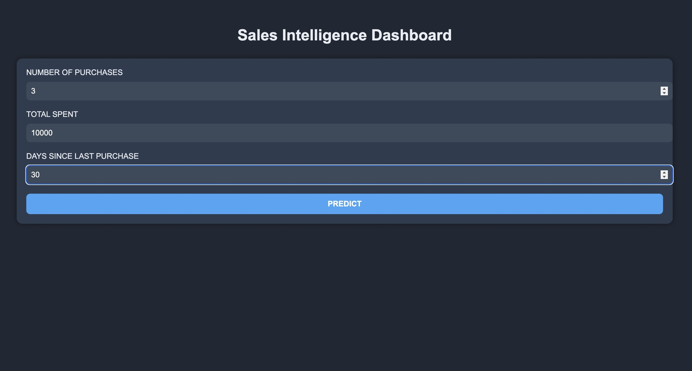
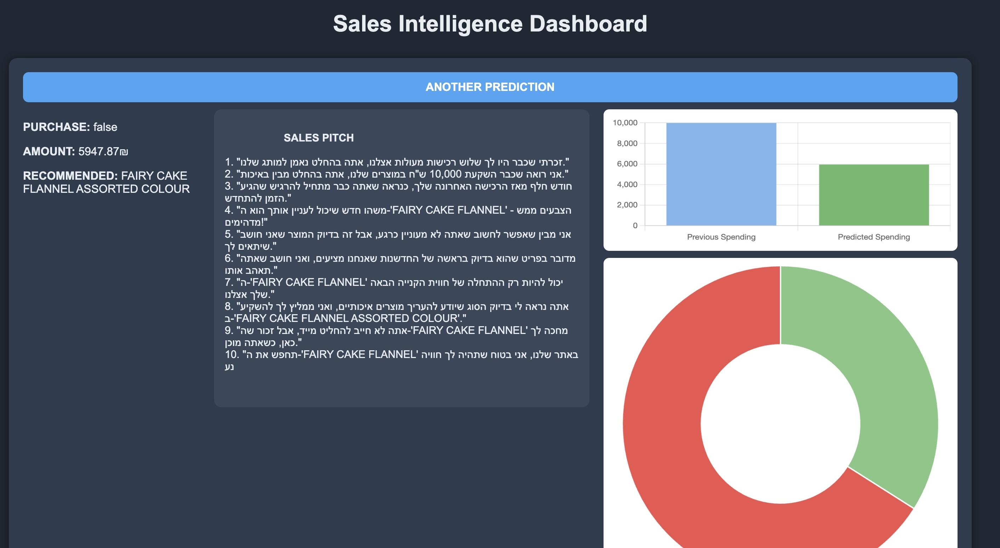

# AI Sales Predictor

## Overview
This project is a machine learning-powered system that predicts:
- Whether a customer will make a purchase
- The expected purchase amount
- Recommended product using KNN
- A personalized marketing pitch using OpenAI's GPT API

## Features
- Logistic Regression to predict customer purchase (Yes/No)
- Linear Regression to estimate the purchase amount
- K-Nearest Neighbors (KNN) to recommend a product
- GPT-4 powered custom sales pitch generation
- Flask-based web application with modern frontend

## Installation

### Option 1 — Manual Installation:

1 Create a virtual environment:

```bash
python -m venv venv
```

2 Activate the environment:

- On Mac/Linux:

```bash
source venv/bin/activate
```

- On Windows:

```bash
venv\Scripts\activate
```

3 Install required packages:

```bash
pip install -r requirements.txt
```


### Option 2 — Automatic Installation (Recommended):

#### For Mac/Linux:

```bash
 setup.sh
 ```

#### For Windows:

```bash
setup.bat
```

The script will handle everything for you.

## API Key Setup

Before running the application, you must configure your OpenAI API key.

1 Create a file named `.env` in the root directory of the project.

2 Inside the file, add the following line:

OPENAI_API_KEY=your_openai_api_key_here

3 Replace `your_openai_api_key_here` with your actual OpenAI API key obtained from your OpenAI account.

 Note: The `.env` file is not included in this repository for security reasons. You must create it manually before running the app.

 ## Running the Application

1 After completing the installation and API key setup, run:

    python app.py
2  Once the application starts, open your browser and navigate to:

    ```bash
    http://127.0.0.1:5000
    ```
    to access the AI Sales Predictor dashboard.


## Tech Stack
- Python
- Flask
- Scikit-learn
- Pandas
- OpenAI GPT API
- HTML/CSS/JavaScript

## Screenshots

### Input Form
Here is the form where the user provides purchase history:



### Prediction Results
Here is the full dashboard displaying predictions, recommendations, generated sales pitch, and charts:



## Project Structure
- `app.py`: Main Flask application
- `train_knn_model.py`: Trains the product recommendation model
- `models/`: Contains saved ML models
- `templates/` and `static/`: Frontend files

## Contact
Created by Ido Cohen – feel free to connect with me on [LinkedIn](https://www.linkedin.com/in/ido-cohen-idocohen)!
